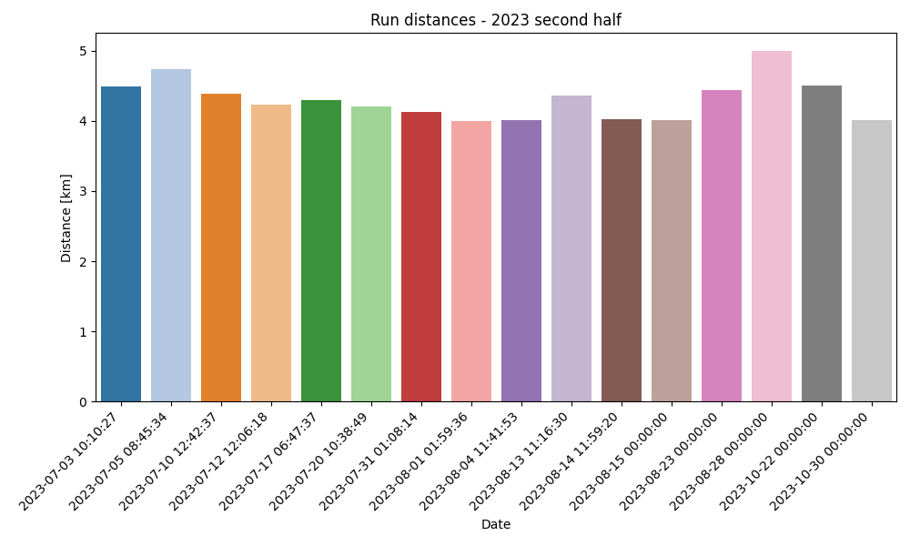
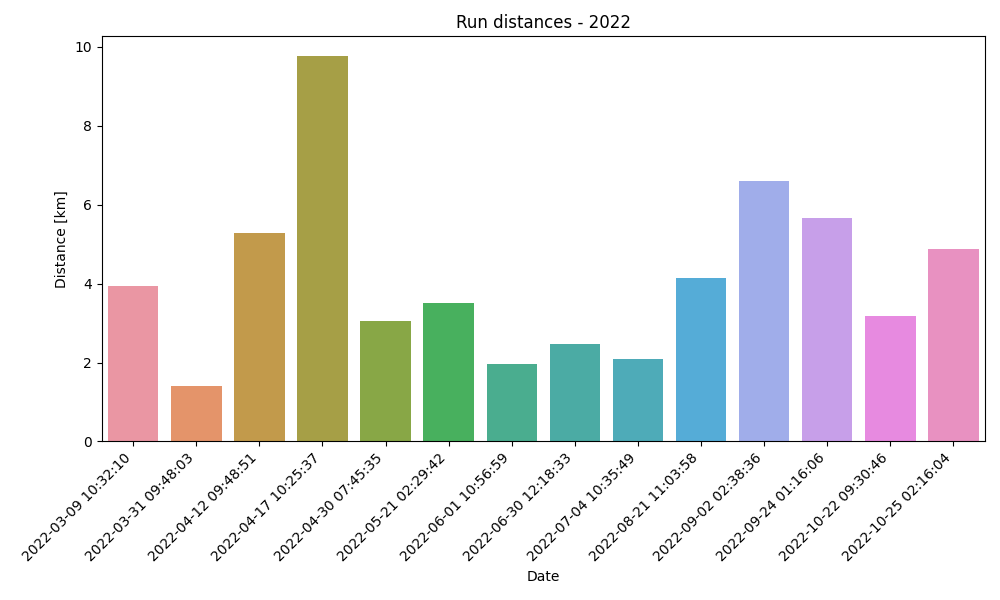
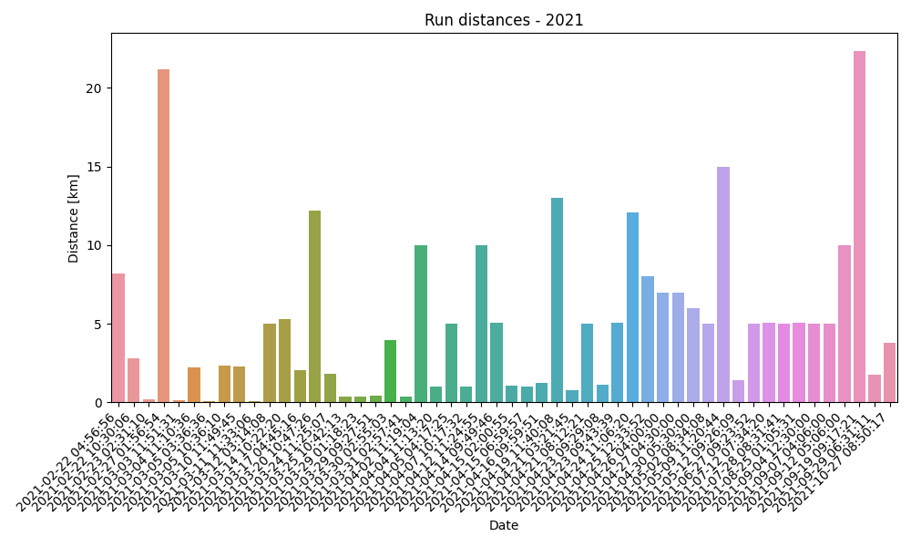

# strava-insights
Analysis and visualization of Strava activities

## Data

[Requesting a bulk data export](https://support.strava.com/hc/en-us/articles/216918437-Exporting-your-Data-and-Bulk-Export#h_01GG58HC4F1BGQ9PQZZVANN6WF)

## Usage

  
calculating statistics and creating figures

running the Python module to create figures: 
`python3 src/plot.py`

running the TypeScript module to calculate statistics: 
compilation: `tsc src/calc.ts` 
running: `node src/calc.js`

## Plots

  
  

<!-- Below: all runs uploaded to Strava
 -->

<!-- 

  

  

  

 -->
